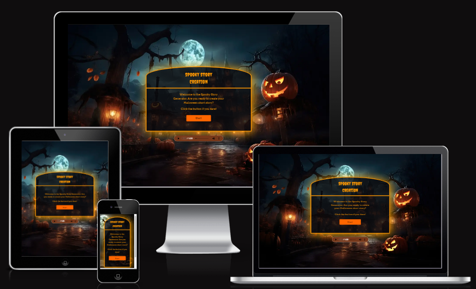

# **The Spookies** Spooky story creation

Link to live website: [Spooky story creation](https://avtpepper.github.io/halloween-hackathon/)

## Introduction

**Spooky story creation**
is an website that generates scary stories with OpenAI. Stories are tailored to the the users preferred specifications. 

This is project created by a group of Code Institute students/alumna for the [October Halloween Hackathon](https://hackathon.codeinstitute.net/hackathon/38/).

### Agile Methodology

Our team successfully implemented the Agile Methodology throughout the development process of the website. By employing Agile principles, we prioritized collaboration, adaptability, and iterative progress. We did this by regular meetings, continuous communication on Slack and making use of the project board on Github with Epics, user stories and issues.

Our Github projects board during development:

### UX / UI

Designed to immerse the user in a spooky environment with visual effects and sounds.
Playful scary images used and strong colour pallet is chosen.

#### Initial wireframe sketches
The wireframes of this project are (important: the final project may be slightly different):

#### Colour palette
We agreed in using standard colours of Halloween celebration. They can be found all over the project from the images to the styling of elements:

#### Typography
Fonts were selected from Google Fonts and they stick to the theme of this project. 
The Creepster font gives the tone for presenting the website and the main sections:

The Arvo font is elegant and clear for the user to understand the blocks of text: 
 

#### Favicon
With the intention of keeping the spirit of Halloween, a favicon has been integrated:

## Existing features

### Introduction animation
To immediatly set the appropriate tone, user is introduced to the website with spooky animations. Starting with smooth calm transitions to lure the user into a false sense of security and then followed by a startling surprise.

### Introduction page

The introduction page is where the user introduced to the story creator and can begin their journey.

### User choices

User has multiple options to choose from along the way that affects the generated story.

### Generate story

After all decisions have been made a story is generated, it is displayed with animations and sound for a great reading experience.

### About us page

Here user is thanked for visiting the page and get to meet the creators.

## Features left to implement

- Having the choice to read story with TTS (text to speech) for users with disabilities.
- Form validation to check that user enters a name and selects age option.
- Better transitions and more scary animations.
- Enable user to handle (play/mute) audio before opening sequence.

## Testing

### Automatic testing

- HTML
Validated through https://validator.w3.org/#validate_by_input and passed
    

- CSS
Validated through https://jigsaw.w3.org/css-validator/validator and passed
    

- Lighthouse testing
Used lighthouse to test performance, accessibility, best practices, and search engine optimization of the website. 

    

### Manual testing

| Feature tested | Expected outcome | Testing Performed | Result | Pass / fail | 
| --- | --- | --- | --- | --- |
| **Introduction screen** |
| Introduction animation | Show animations after page is loaded | Load page | Animations show correctly | Pass |
| Introduction screen | Display introduction screen | Load page and wait for animations to finish | Introduction screen is displayed | Pass |
| **Story creation** |
| User choices | Story changes based on user input | Make choices and generate story | Generated story matches the choices from user input | Pass |
| **Story screen** |
| Generate story | Create a story | Click on "Generate story" | Creates a story | Pass |
| Story anymation | Display story slowly and play sounds | Click on "Generate story" and wait | A story is created and animates slowly while sound is playing | Pass |
| **About us page** |
| About us | Option to display about us page after story is finished | Wait for story to finish and click on "About us" | Displays about us page | Pass |

## Bugs

### Solved bugs

A large number of scary bugs was accidentally created during development and had to be fixed.
Fixes included:
- communicating with team members
- looking in chrome developer tools to check for warning messages
- looking through code line by line
- using console.log(); to see what was acctually going on
- review commit history
- search google for possible solutions
- a lot of trial and error

### Unfixed bugs

On rare occations the story is not generated. We can not find any logical reason for this. 

## Technologies used

### Languages & Frameworks & Tools

- HTML
- CSS
- JavaScript
- Bootstrap
- OpenAI

## Deployment

The site was deployed to GitHub pages. The steps to deploy are as follows:
- In the GitHub repository, navigate to the Settings tab
- Click on Pages in the menu on the right side in the Code and Automation section
- Under Branch, select main in the dropdown menu and click save
- Once the main branch has been selected and saved, the page will be automatically refreshed with a detailed ribbon display to indicate the successful deployment.

Link to live website: [Spooky story creation](https://avtpepper.github.io/halloween-hackathon/)

## Contributors

- Alex - [AVTpepper](https://github.com/AVTpepper)
- Sara - [sbojorge](https://github.com/sbojorge)
- Samuel - [FullstackSammy](https://github.com/FullstackSammy)
- Niclas - [NiclO1337](https://github.com/NiclO1337)

## Credits

### Tutorials

Audio element styling inspired from: [Shahed Nasser's blog](https://blog.shahednasser.com/how-to-style-an-audio-element/) 

### Media

#### Images

- Werewolf image by <a href="https://pixabay.com/illustrations/werewolf-wolf-fantasia-horror-dark-8070653/">Sabrina Belle</a>
- Background images and favicon image come from [rawpixel](https://www.rawpixel.com/)

#### Audio
Audio tracks come from [freesound](https://freesound.org/)